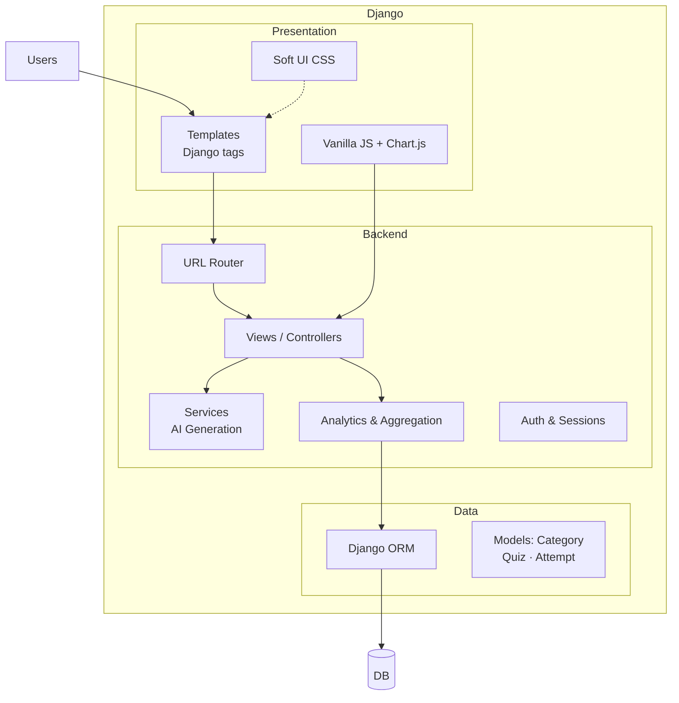
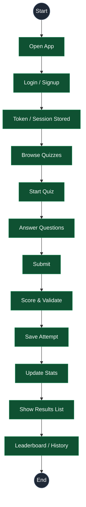
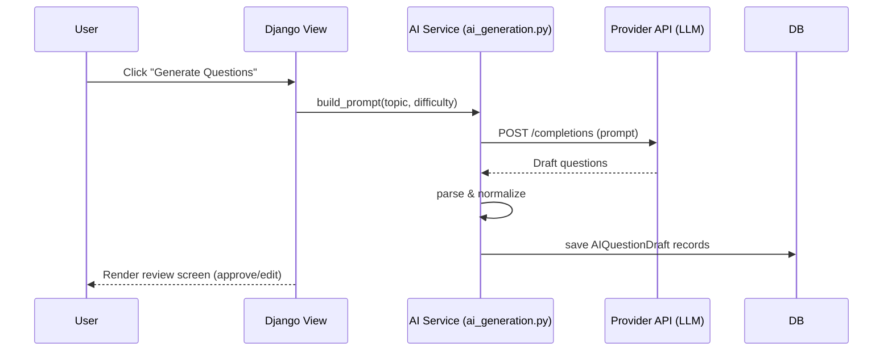
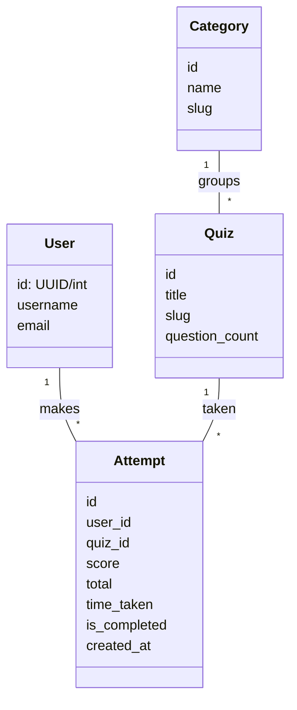

**Project Objective**
- Goal: Build an Intelligent Quiz Management System that automates question generation, delivers adaptive user assessment, and provides rich performance analytics (category breakdown, leaderboard, attempt history).
- Relevance: Reduces manual quiz creation time, standardizes evaluation quality, and enables scalable, data-driven learning experiences for educators, training teams, and internal upskilling programs.
- Strategic Value: Accelerates content deployment, increases engagement through achievements and gamified UI, and creates a foundation for personalized learning pathways (future AI recommendations).

**Project Description**
- Core Capabilities: Quiz authoring (manual + AI‑assisted), automatic question generation, timed quiz sessions, scoring & result processing, attempt tracking, category performance analytics, global & filtered leaderboards, user profile progress, achievements.
- Architecture: Django (views, ORM, templates) + soft UI CSS layer + lightweight vanilla JS enrichment + Chart.js visualization + relational DB (SQLite dev / Postgres prod) + optional AI provider abstraction for question drafts.
- Data Model: Category, SubCategory (if extended), Quiz, Question/Answer (or generated drafts), Attempt (score, total, time_taken, is_completed, timestamp), User Profile (avatar, stats cache).
- AI Layer: Service in `Quizez/services/ai_generation.py` (extensible provider interface) requests topic/context, generates draft questions, normalizes into internal schema, flags for human review (avoids direct injection of unverified content).
- Real‑World Impact:
  - Educators/trainers: Rapid iteration of assessments without manual authoring bottleneck.
  - Organizations: Consistent evaluation across cohorts; analytics improve curriculum refinement.
  - Learners: Immediate feedback, motivation via achievements, visibility of strengths/weaknesses.
- Differentiators: Live category performance visualization, adaptive future scope (difficulty calibration), modular AI integration (swappable providers), clean soft‑gamified UX.

**Project Execution Details**
- Phase 1 (Requirements & Scoping): Identified stakeholders (learners, content creators, administrators); defined KPIs: time to create a quiz, average engagement (attempts/user), accuracy trend.
- Phase 2 (Data Modeling & Core CRUD): Implemented Category → Quiz → Attempt flow; ensured referential integrity; added slug fields for clean URLs; wrote basic admin integration.
- Phase 3 (AI Integration POC): Created abstraction layer for prompt construction + parsing returned text → structured draft; added validation (length, duplicates, answer plausibility).
- Phase 4 (Analytics & Leaderboard): Aggregated Attempt data using ORM queries (avg percent = mean(score/total*100), accuracy, total quizzes, ranking logic with dynamic filters: all_time / this_month / this_week).
- Phase 5 (UI/UX Iteration): Applied soft card layout, responsive grid, minimized vertical whitespace, introduced progress bars and radar chart; refined accessibility (focus, contrast).
- Phase 6 (Performance & Cleanup): Cached frequently used aggregates (optional future step), removed commented‑out code, improved CSS variable usage, normalized percent logic.
- Phase 7 (Testing & Validation): Manual flows (quiz creation, attempt submission, leaderboard filters), boundary cases (0 attempts, high totals), dark/light theme verification.
- Phase 8 (Documentation & Deployment Prep): Added requirements, environment setup instructions, prepared architecture diagrams, roadmap.

**Challenges Faced**
- Percent Calculation Accuracy: Early logic used raw score; fixed by per‑attempt (score/total*100) aggregation—ensuring fairness across varying quiz lengths.
- AI Content Quality Control: Needed guardrails for hallucinations; added review layer and heuristics (reject ambiguous or duplicate questions).
- Layout Stretch & Whitespace: Grid items stretched unevenly; resolved via flex utility + align-items adjustments & condensed card classes.
- Dark Mode Contrast: Some variables produced low contrast; introduced explicit color tokens and revised palette for readability.
- Leaderboard Visibility: Data present but styling hid elements; replaced variable surfaces with explicit colors for clarity.
- Scalability of Aggregations: Frequent ranking queries; prepared for future caching (materialized stats) and filter index optimization.
- Consistency of UX: Iterated between interactive vs. minimal category breakdown; reconciled stakeholder feedback for a clean, informative compromise.
- Time Constraints: Balanced feature depth against internship timeline; prioritized core differentiators (AI generation + analytics) over advanced personalization.

**Learnings & Skills Acquired**
- Technical: Django ORM optimization, template performance hygiene, structured AI prompt design, frontend semantic layout, CSS theming strategy, Chart.js integration, basic data aggregation patterns.
- Tooling: Virtual environments, dependency pinning, migration management, shell data inspection, linting & cleanup scripting.
- Software Practices: Incremental refactoring, rollback strategy, dry-run scripting, heuristic filtering (comment removal), defensive programming in AI ingestion.
- Soft Skills: Requirement negotiation, iteration based on user feedback, clear documentation structuring, prioritization under deadlines.
- Domain Knowledge: Assessment design considerations, metrics for learner performance, gamification elements (badges, leaderboards) and their motivational impact.

**Testimonials from Team (Experience / Success Points)**
- “Reduced manual quiz creation effort—AI drafts cut prep time significantly.”
- “Analytics made it easy to spot weak categories for targeted improvements.”
- “UI felt modern and encouraging; achievements increased repeat attempts.”
(Adapt these with actual mentor/team feedback once collected.)

**Conclusion**
- Outcome: Delivered a functional, extensible quiz platform with automated question generation and robust analytics, aligning with organizational goals of scalable assessment.
- Impact: Streamlines content delivery, enhances learner engagement, establishes groundwork for adaptive intelligence.
- Career Alignment: Strengthened backend + AI integration skillset, validated interest in applied educational technology & data-driven product development.

**Acknowledgements**
- Organization & Program Coordinators: For opportunity and guidance.
- Mentor(s): For architectural review, AI prompt refinement, code quality feedback.
- Team Members / Peers: For collaborative testing and UX input.
- Open Source Community: Django & ecosystem maintainers enabling rapid development.

Next Optional Deliverables (if needed):
- Architecture diagram (frontend ↔ backend ↔ AI provider)
- API reference sheet (endpoints, sample responses)
- Future roadmap doc (adaptive difficulty, personalization engine)

If you’d like, I can generate:
- A concise one‑page executive summary
- A visual architecture diagram outline
- A Markdown version of this documentation

Let me know which you’d like next.

---

## Diagrams (Mermaid)
Paste this file into any Markdown viewer that supports Mermaid (GitHub, VS Code with Markdown Preview Mermaid). These diagrams capture architecture, user flow, AI generation, and data model.

### 1) System Context
```mermaid
flowchart LR
  user[User / Learner] -->|HTTP(S)| web[Browser UI<br/>Templates + CSS/JS]
  web -->|Routes| app[(Django App<br/>Views + URLs)]
  app --> orm[(Django ORM)]
  orm --> db[(Relational DB<br/>SQLite / Postgres)]
  app -->|Generate Draft| ai[AI Provider<br/>(LLM API)]
  web --> assets[Static Assets<br/>CSS · JS · Images]
  app --> media[Media Storage<br/>Profile pics]

  classDef svc fill:#eef2ff,stroke:#6366f1,stroke-width:1px,color:#111827;
  classDef db fill:#ecfdf5,stroke:#10b981,stroke-width:1px,color:#064e3b;
  class app,web,assets,media svc; class db db; class orm svc; class ai svc;
```

### 2) Containers (inside Django)


### 3) End‑to‑End User Flow (Quizzing) – Vertical Form


### 4) AI Question Generation (Sequence)


### 5) Leaderboard Aggregation Flow
```mermaid
flowchart LR
  F[Filter<br/>all_time | this_week | this_month] --> Q[Query Attempts<br/>(is_completed=1)]
  Q --> M[Compute Metrics<br/>avg% · quizzes · points · accuracy]
  M --> R[Rank + Medal]
  R --> L[Render Template]
  L --> UI[Leaderboard UI]
```

### 6) Data Model (ER‑style)


### 7) Component Responsibilities
- Views: route requests, validate input, orchestrate services.
- Services: AI integration, parsing, analytics helpers.
- ORM/Models: persistence, relationships, constraints.
- Templates/CSS/JS: presentation, charts, small interactions.

Tips
- You can copy any diagram block into draw.io/Excalidraw/Mermaid Live for export.
- For PPT, export as SVG/PNG and place on a purple gradient background (#6366F1→#5B21B6).
